# Exploring Capability 7: Container Security

## 1. Wazuh to Monitor Docker Containers

### Steps: 

- Installing wazuh agent on the docker server

    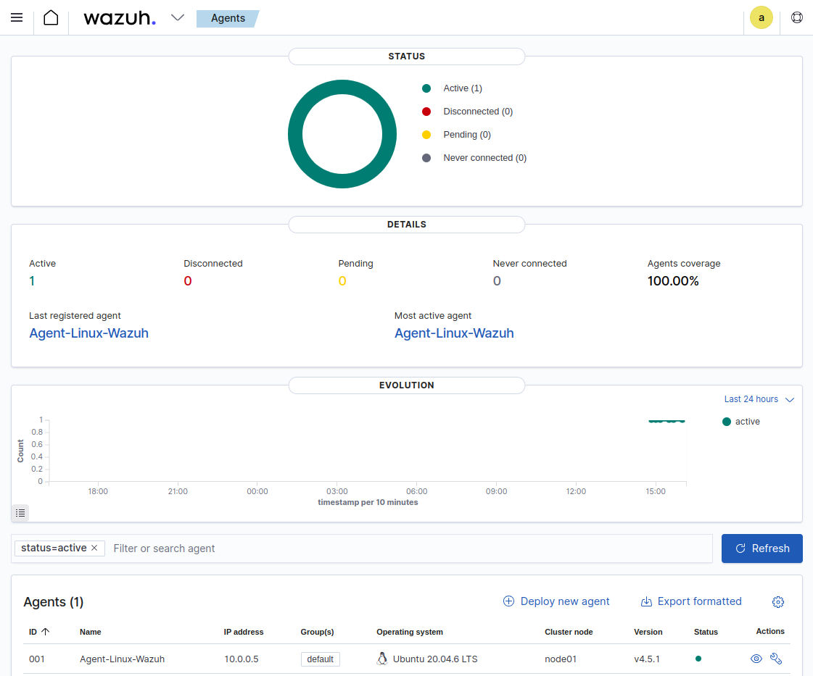

- Enabling wazuh docker listener
    - installing python, pip and docker module

        ```yum update && yum install python3```

        ```apt-get install python3-pip```

        ```pip3 install docker==4.2.0```

    - configuring the wazuh agent: enabling docker listener

       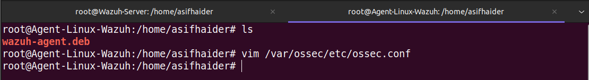

       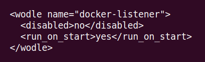

    - restarting the agent to apply changes

        ```systemctl restart wazuh-agent```

- Verifying the docker listener at the wazuh dashboard

    `Menu` -> `Settings` -> `Modules` -> `Threat Detection and Response` -> enable `Docker listener`

    `Menu` -> `Modules` -> `Docker listener`

    Docker Dashboard

    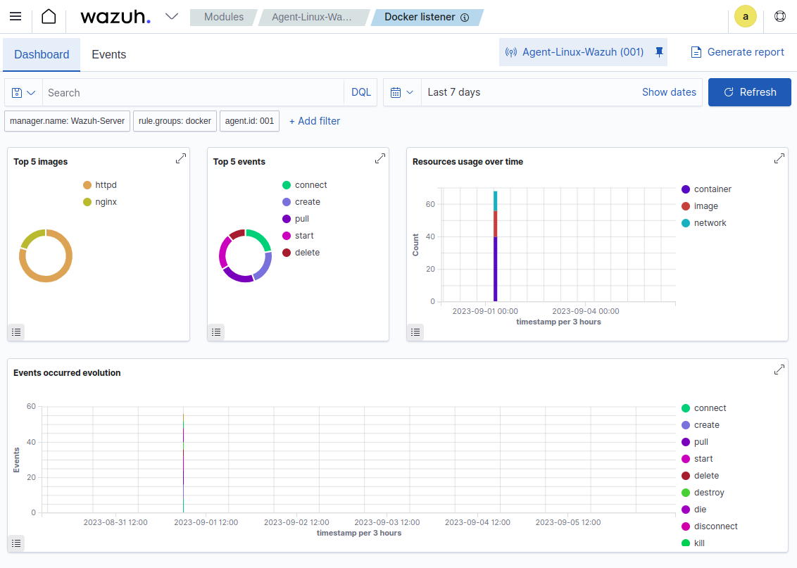

    Docker Events

    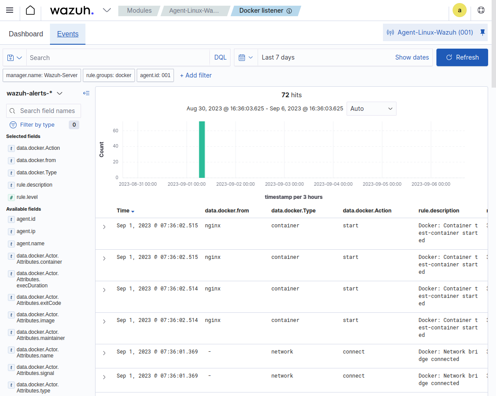

## Example Usecase:

### Monitoring container events and alerts

- Running, pausing, unpausing, stopping and removing a test container

    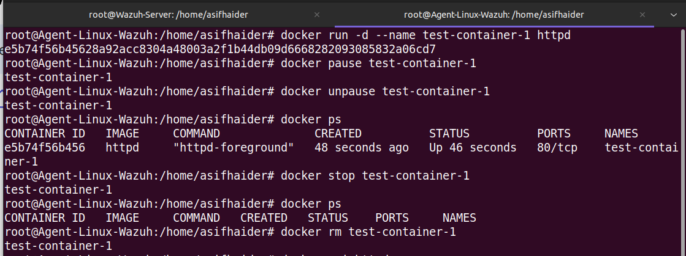

- Viewing the corresponding alerts on `Docker listener dashboard` -> `Events` 

    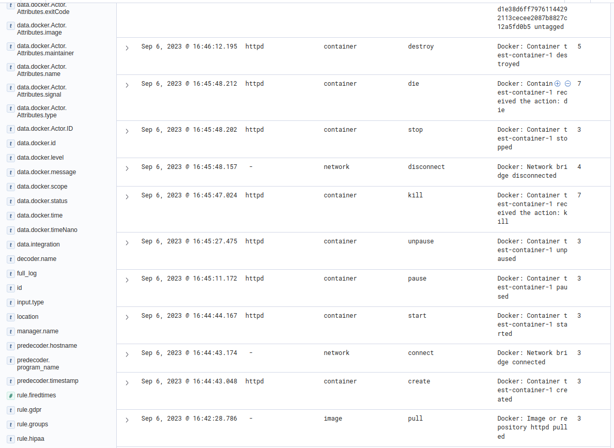

- The full json data when the container gets started: 

    ```
    {
  "_index": "wazuh-alerts-4.x-2023.09.06",
  "_id": "6mMYaooB3jYmV_0qNAN7",
  "_version": 1,
  "_score": null,
  "_source": {
    "input": {
      "type": "log"
    },
    "agent": {
      "ip": "10.0.0.5",
      "name": "Agent-Linux-Wazuh",
      "id": "001"
    },
    "manager": {
      "name": "Wazuh-Server"
    },
    "data": {
      "integration": "docker",
      "docker": {
        "Type": "container",
        "Action": "start",
        "Actor": {
          "Attributes": {
            "image": "httpd",
            "name": "test-container-1"
          },
          "ID": "e5b74f56b45628a92acc8304a48003a2f1b44db09d6668282093085832a06cd7"
        },
        "scope": "local",
        "from": "httpd",
        "timeNano": "1693997084162952960.000000",
        "id": "e5b74f56b45628a92acc8304a48003a2f1b44db09d6668282093085832a06cd7",
        "time": "1693997084",
        "status": "start"
      }
    },
    "rule": {
      "firedtimes": 1,
      "mail": false,
      "level": 3,
      "description": "Docker: Container test-container-1 started",
      "groups": [
        "docker"
      ],
      "id": "87903"
    },
    "location": "Wazuh-Docker",
    "decoder": {
      "name": "json"
    },
    "id": "1693997084.126916",
    "timestamp": "2023-09-06T10:44:44.167+0000"
  },
  "fields": {
    "timestamp": [
      "2023-09-06T10:44:44.167Z"
    ]
  },
  "highlight": {
    "agent.id": [
      "@opensearch-dashboards-highlighted-field@001@/opensearch-dashboards-highlighted-field@"
    ],
    "manager.name": [
      "@opensearch-dashboards-highlighted-field@Wazuh-Server@/opensearch-dashboards-highlighted-field@"
    ],
    "rule.groups": [
      "@opensearch-dashboards-highlighted-field@docker@/opensearch-dashboards-highlighted-field@"
    ]
  },
  "sort": [
    1693997084167
  ] }
  ```

### Monitoring container runtime logs

- Configuring wazuh agent in `/var/ossec/etc/ossec.conf` file

    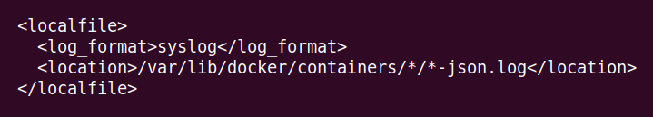

    - restarting agent

        ```systemctl restart wazuh-agent```

- Configuring wazuh server in `/var/ossec/etc/decoders/local_decoder.xml` file: add web-access-log and json decoders 

    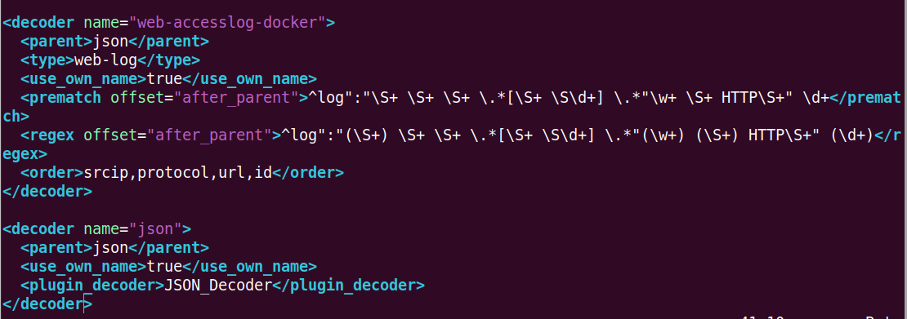

    - restarting server

        ```systemctl restart wazuh-manager```

- Running docker container to simulate attack

    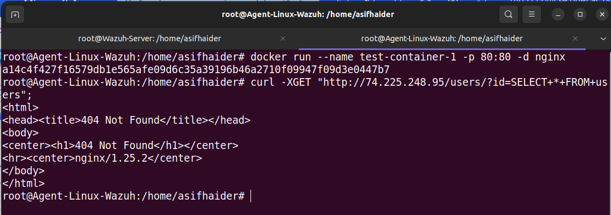

- Viewing corresponding alerts on the dashboard -> `Security events`

    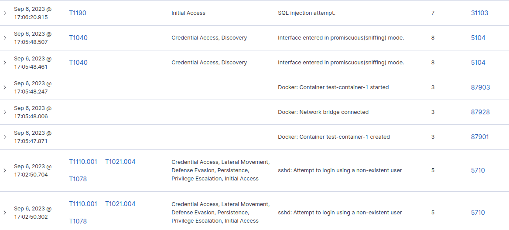

- The full json data for the attack

    ```
    {
  "agent": {
    "ip": "10.0.0.5",
    "name": "Agent-Linux-Wazuh",
    "id": "001"
  },
  "manager": {
    "name": "Wazuh-Server"
  },
  "data": {
    "protocol": "GET",
    "srcip": "74.225.248.95",
    "id": "404",
    "url": "/users/?id=SELECT+*+FROM+users"
  },
  "rule": {
    "firedtimes": 1,
    "mail": false,
    "level": 7,
    "pci_dss": [
      "6.5",
      "11.4",
      "6.5.1"
    ],
    "tsc": [
      "CC6.6",
      "CC7.1",
      "CC8.1",
      "CC6.1",
      "CC6.8",
      "CC7.2",
      "CC7.3"
    ],
    "description": "SQL injection attempt.",
    "groups": [
      "web",
      "accesslog",
      "attack",
      "sql_injection"
    ],
    "mitre": {
      "technique": [
        "Exploit Public-Facing Application"
      ],
      "id": [
        "T1190"
      ],
      "tactic": [
        "Initial Access"
      ]
    },
    "id": "31103",
    "nist_800_53": [
      "SA.11",
      "SI.4"
    ],
    "gdpr": [
      "IV_35.7.d"
    ]
  },
  "decoder": {
    "parent": "json",
    "name": "web-accesslog-docker"
  },
  "full_log": "{\"log\":\"74.225.248.95 - - [06/Sep/2023:11:06:20 +0000] \\\"GET /users/?id=SELECT+*+FROM+users HTTP/1.1\\\" 404 153 \\\"-\\\" \\\"curl/7.68.0\\\" \\\"-\\\"\\n\",\"stream\":\"stdout\",\"time\":\"2023-09-06T11:06:20.794120922Z\"}",
  "input": {
    "type": "log"
  },
  "@timestamp": "2023-09-06T11:06:20.915Z",
  "location": "/var/lib/docker/containers/a14c4f427f16579db1e565afe09d6c35a39196b46a2710f09947f09d3e0447b7/a14c4f427f16579db1e565afe09d6c35a39196b46a2710f09947f09d3e0447b7-json.log",
  "id": "1693998380.263025",
  "GeoLocation": {
    "country_name": "United States",
    "location": {
      "lon": -97.822,
      "lat": 37.751
    }
  },
  "timestamp": "2023-09-06T11:06:20.915+0000",
  "_id": "FGMsaooB3jYmV_0qDwUS"
  }
  ```
