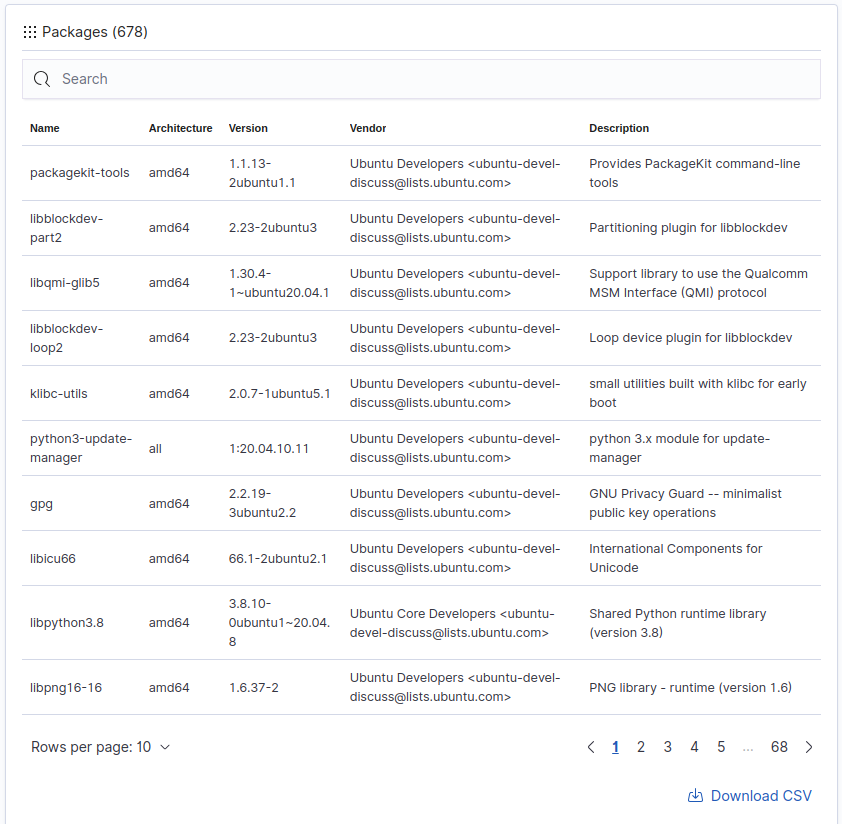

# Exploring Capability 8: System Inventory

Wazuh agent uses the `Syscollector` module to gather relevant information from the monitored endpoint. The module runs periodical scans and collects data on the system properties defined in the configuration. 

## 1. Configuration

- Add the `Syscollector` configuration in the agent machine in the following endpoint 

    `/var/ossec/etc/ossec.conf`

    

## 2. Viewing System Inventory Data

- Go to Agent List -> Click Agent -> Top right corner Inventory Data 

    

    

    

- Operating system, hardware, processes, network interface, and packages details

## 3. Querying Agent Inventory Database

